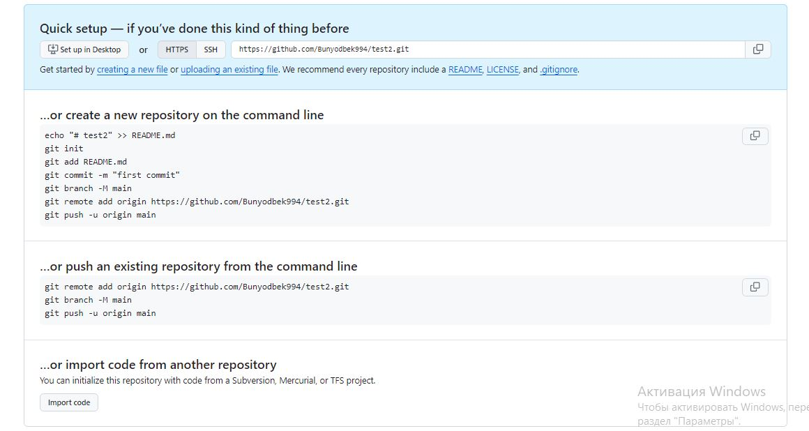

# Vetka boyicha malumotlar

## 1 - Vetkalarni ro'yhatini ko'rish (tekshirish)
```
git branch
```

## 2 - Vetka yaratish.

```
"git branch <vetka nomi>" yordamida
```

## 3 - Vetkalarni birlashtirish
```
"git merge <vetka nomi>" yordamida
```
## 4 - Vetkani o'chirish (udalit)
```
"git branch -d <vetka nomi>" yordamida

```
## 5 - Vetka nomini o'zgartish
```
git branch -M <vetka_nomi> 
```

# BOSHQA BUYRUQLAR

## 1 - Gitni ishga tushurish.
```
git init
```
## 2 - fayl holatni bilish.
```
git status
```
## 3 - O'zgarishlarni saqlash.
```
git add <qwe.md>
```
## 4 - saqlashni bekor qilish.
```
git restore <qwe.md>
```
## 5 - salashni tugatish uchun "izoh" qoldirish shart
```
git commit -m "izoh"
```
## 6 -  saqlashlar tarixini ko'rish
```
git log
```
## 7 - loglarni qisqartirilgan holda ko'rish
```
git log --oneline.
```
## 8 - loglarni grafik ko'rish
```
git log --oneline --graph.
```
## 9 - loglar orqali orqaga qaytarish yoki vetkaga o'tish
```
git checkout <log, yoki vetka nomi>
```

# Gitni githubga ulash

## Gitni ulashdan oldin vetka nomini master dan - main ga o'zgartirib olish kerak.
O'zgartirish:
```sh
git branch -M <vetka_nomi>
```
ulash uchun ketma ket qadamlar:

```sh
1. git remote add origin https://github.com/Bunyodbek994/test2.git

2. git push -u origin main
```




# Gitni GitHubdan uzish

```sh
git remote remove origin
```

# Gitni GitHubga ulangan adresini almashtirish

## Gitni bir repozitoriyadan boshqa bir repazitoriyaga to'g'ridan-to'g'ri almashtirish yoki ulash
```sh
git remote set-url origin https://github.com/Bunyodbek994/test2.git
```

# Git qaysi repozitoriyaga ulanganini ko'rish

## Qisqacha ko'rish
```sh
git remote -v 
```

## To'liq ko'rish

```sh
git remote show origin
```

# Git clone

## GitHub dan git clone yordamida kerakli repozitoriyani localga yuklab olish
```sh
git clone https://github.com/Bunyodbek994/test2.git
```

# GitHub dagi vetkani VS Code terminalidan foydalanib buyruq yordamida o'chirish
```sh
git push origin --delete <vetka_nomii>
```